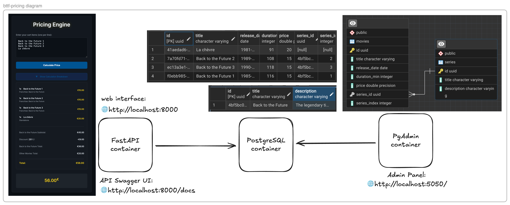
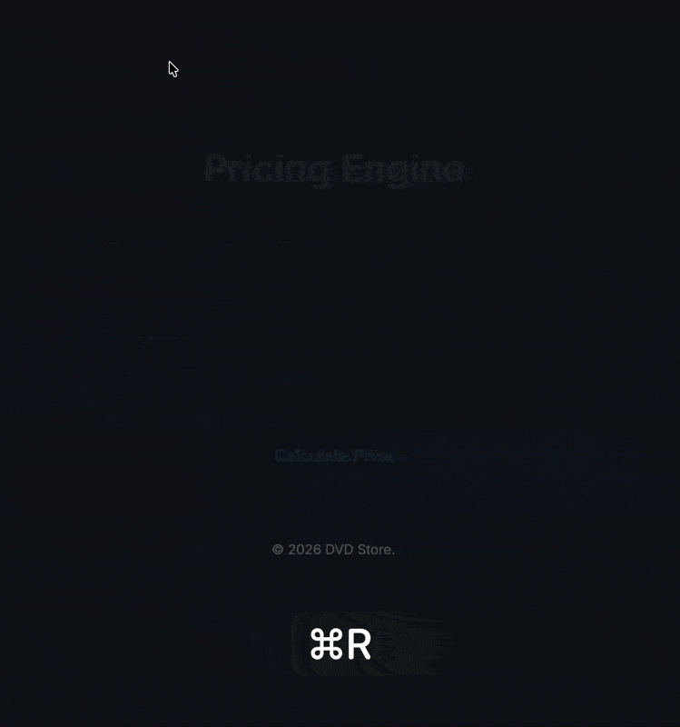

# Back to the Future Pricing Engine

An advanced pricing engine API for the "Back to the Future" DVD saga, built with Python, FastAPI, and Clean Architecture principles.




## Live Preview

Interactive live demo: [🔗 https://bttf-pricing-production.up.railway.app/](https://bttf-pricing-production.up.railway.app/)



## Features

- **Pricing Logic**:
  - One BTTF DVD: 15€
  - Two *distinct* BTTF DVDs: 10% discount on BTTF items.
  - Three (or more) *distinct* BTTF DVDs: 20% discount on BTTF items.
  - Other movies: 20€ each.
- **API**: RESTful API to calculate cart prices.
- **Frontend**: Premium, dark-themed responsive UI.
- **Architecture**: Modular, testable, and maintainable codebase.

## System Architecture

The application follows Clean Architecture principles with:
- **Domain Layer**: Core pricing models and business logic
- **Core Layer**: Business strategies and database integration
- **API Layer**: FastAPI endpoints for RESTful communication
- **Presentation Layer**: Responsive dark-themed web interface

## Running the Project

### Prerequisites

- Python 3.10+
- Docker (Running)

### Installation

1. Clone the repository.

```bash
git clone https://github.com/R3-da/bttf-pricing.git
cd bttf-pricing
cp .env.example .env
```

The project supports two different Docker Compose configurations for flexibility in development and deployment:

### Option 1: Staging/Production Simulation (docker-compose.staging.yml)

**Best for**: Testing production-like environment

**Start the staging environment:**
```bash
docker-compose -f docker-compose.staging.yml up --build
```

**Stop the environment:**
```bash
docker-compose -f docker-compose.staging.yml down
```

### Option 2: Local Development (docker-compose.dev.yml)

**Best for**: Interactive development with hot reloads

**Start the database environment:**
```bash
docker-compose -f docker-compose.dev.yml up --build
```

**Install dependencies:**

```bash
pip install poetry
poetry install
```

**Start the app server:**

```bash
poetry run uvicorn src.main:app --reload
```

**Stop the environment:**
```bash
docker-compose -f docker-compose.dev.yml down
```

## Access the application:
- Web Interface: [http://localhost:8000](http://localhost:8000)
- API Documentation (Swagger): [http://localhost:8000/docs](http://localhost:8000/docs)
- Database Admin: [http://localhost:5050](http://localhost:5050)

## Testing & Code Quality

### Running Tests

Run tests using:

```bash
poetry run pytest
```

Run tests and generate code coverage:
```bash
poetry run pytest --cov=src --cov-report=term-missing --cov-report=xml --cov-report=html
```

Open htmlcov/index.html to see coverage report. (latest measured coverage: ~60%)

Check code quality and coverage on SonarCloud: [🔗 https://sonarcloud.io/summary/overall?id=R3-da_bttf-pricing&branch=main](https://sonarcloud.io/summary/overall?id=R3-da_bttf-pricing&branch=main)

### Code Formatting & Linting

The project uses industry-standard tools to maintain consistent code quality:

**Black** - Automatic code formatter

**Flake8** - Style guide enforcement

**Pre-commit Hooks** - Automated quality checks

When you commit, the hooks automatically:
1. Run all tests (must pass to commit)
2. Format code with Black
3. Check code quality with Flake8

To activate this behaviour run:

```bash
poetry run pre-commit install
```

Remove it using:

```bash
poetry run pre-commit uninstall
```

### Manual Code Quality Checks

Format code with Black:
```bash
poetry run black .
```

Check code with Flake8:
```bash
poetry run flake8 .
```

## Project Structure

```
.
├── src/
│   ├── api/          # API endpoints and routing
│   ├── core/         # Business logic & strategies
│   ├── domain/       # Domain models (Cart, Movie)
│   └── main.py       # Application entry point
├── static/           # Frontend assets (HTML, CSS, JS)
├── tests/            # Unit and Integration tests
├── migrations/       # Database migrations (Alembic)
├── assets/           # Project diagrams and assets
├── Dockerfile        # Docker configuration
├── docker-compose.dev.yml      # Development Docker setup
├── docker-compose.staging.yml  # Staging Docker setup
├── .pre-commit-config.yaml     # Pre-commit hooks configuration
├── pyproject.toml    # Project configuration
└── README.md         # This file
```
